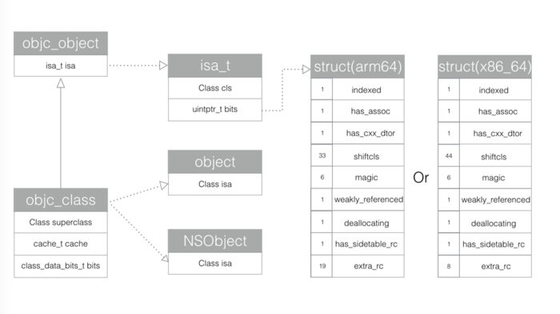
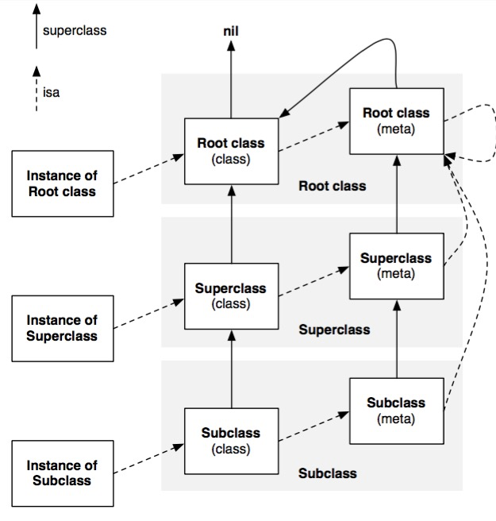
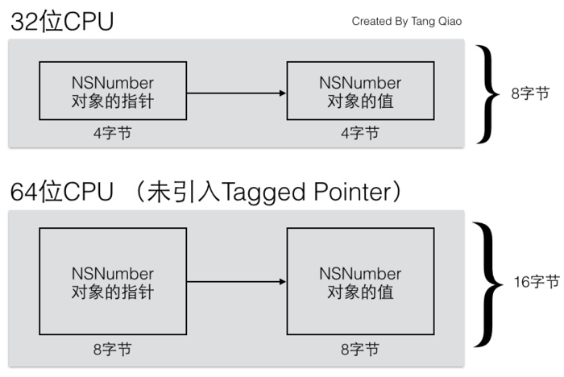
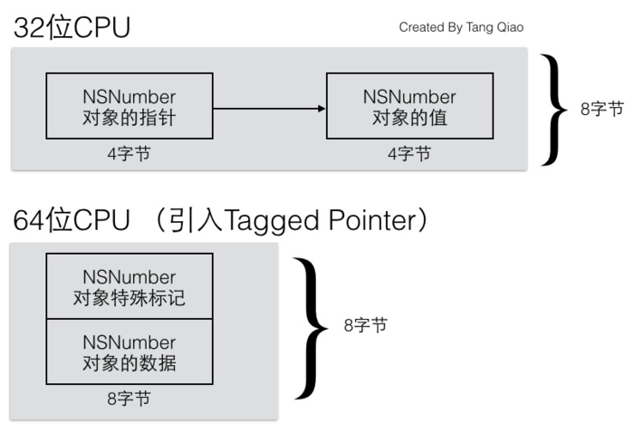
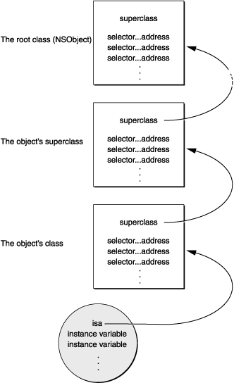
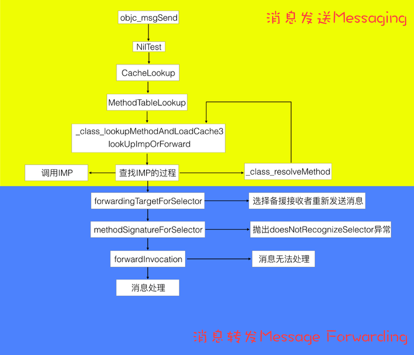
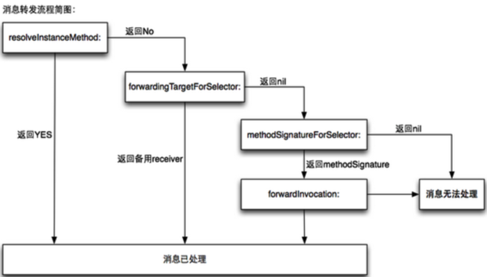

# Runtime
Runtime又叫运行时。编码过程中，开发者可以给任意一个对象发送消息，在编译阶段只是确定了要向接收者发送这条消息，而接受者要如何响应和处理这条消息，就要看运行时来决定了。

C语言中，在编译期，函数的调用就会决定调用哪个函数。
而OC的函数，属于动态调用过程，在编译期不能决定调用哪个函数，只有在真正运行时才会依据函数的名称找到对应的函数来调用。

**1.通过Objective-C源代码**
一般情况开发者只需要编写 OC 代码即可，Runtime 系统自动在幕后把我们写的源代码在编译阶段转换成运行时代码，在运行时确定对应的数据结构和调用具体哪个方法。

**2.通过 Foundation 框架的 NSObject 类定义的方法**
在NSObject协议中，有以下5个方法，可以从Runtime中获取信息，让对象进行自我检查。

```
- (Class)class OBJC_SWIFT_UNAVAILABLE("use 'anObject.dynamicType' instead");
- (BOOL)isKindOfClass:(Class)aClass;
- (BOOL)isMemberOfClass:(Class)aClass;
- (BOOL)conformsToProtocol:(Protocol *)aProtocol;
- (BOOL)respondsToSelector:(SEL)aSelector;
```

在NSObject的类中，还定义了一个方法：

```
- (IMP)methodForSelector:(SEL)aSelector;
```
这个方法会返回指定方法实现的地址IMP。

**3.通过对Runtime库函数的直接调用**

##NSObject

NSObject定义如下

```
typedef struct objc_class *Class;

@interface NSObject <NSObject> {
    Class isa  OBJC_ISA_AVAILABILITY;
}
```

objc_class 2.0之前源码：

```
struct objc_class {
    Class isa  OBJC_ISA_AVAILABILITY;
    
#if !__OBJC2__
    Class super_class                                        OBJC2_UNAVAILABLE;
    const char *name                                         OBJC2_UNAVAILABLE;
    long version                                             OBJC2_UNAVAILABLE;
    long info                                                OBJC2_UNAVAILABLE;
    long instance_size                                       OBJC2_UNAVAILABLE;
    struct objc_ivar_list *ivars                             OBJC2_UNAVAILABLE;
    struct objc_method_list **methodLists                    OBJC2_UNAVAILABLE;
    struct objc_cache *cache                                 OBJC2_UNAVAILABLE;
    struct objc_protocol_list *protocols                     OBJC2_UNAVAILABLE;
#endif
    
} OBJC2_UNAVAILABLE;
```
在一个类中，有超类的指针，类名，版本信息。
`ivars` 是`objc_ivar_list`成员变量列表的指针。
`methodLists`是指向`objc_method_list`指针的指针， `*methodList`是指向方法列表的指针。如果动态修改`*methodList`来添加成员方法，喝酒时category的实现原理，也说明了category不能添加属性的原因。

Objc 2.0之后，objc_class定义改变了

```
typedef struct objc_class *Class;
typedef struct objc_object *id;

@interface Object { 
    Class isa; 
}

@interface NSObject <NSObject> {
    Class isa  OBJC_ISA_AVAILABILITY;
}

struct objc_object {
private:
    isa_t isa;
}

struct objc_class : objc_object {
    // Class ISA;
    Class superclass;
    cache_t cache;             // formerly cache pointer and vtable
    class_data_bits_t bits;    // class_rw_t * plus custom rr/alloc flags
}

union isa_t 
{
    isa_t() { }
    isa_t(uintptr_t value) : bits(value) { }
    Class cls;
    uintptr_t bits;
}
```



objective-C对象都是C语言结构体实现的，在objc2.0中，所有的对象都会包含一个isa_t类型的结构体

objc_object被源码typedef成了id类型，这也就是我们平时遇到的id类型。这个结构体中值包含了一个isa_t类型的结构体。

objc_class继承于objc_object。所以在objc_class中也会包含isa_t类型的结构体isa。Objective-C中类也是一个对象。在objc_class中，除了isa之外，还有三个成员变量一个是父类的指针，一个是方法缓存，最后一个这个类的示例方法链表。

object类和NSObject类里面分别都包含一个objc_class类型的isa。

当一个对象的示例方法被调用的时候，会通过isa找到相应的类，然后在该类的class_data_bits_t中查找方法。class_data_its_t是指向了类对象的数据区域。在改数据区域内找相应方法的对应实现。

在我们调用类方法的时候，为了和对象查找方法的机制一致，引入了元类（meta-class）的概念。

**对象的示例方法调用时，通过对象的isa在类中获取方法的实现**
**类对象的类方法调用时，通过类的ias在元类中获取方法的实现**

meta-class存储了一个类的所有类方法。每个类都会有一个单独的meta-class，因为每个类的类方法基本不可能完全相同。


实线是super_class指针，虚线是isa指针

1. Root class（class）其实就是NSObject，NSObjct是没有超类的，所以Root class（class）的superclass指向nil
2. 每个Class都有一个isa指针指向唯一的meta-class
3. Root class（meta）的super class指向Root class（meta），也就是NSObject，形成一个回路
4. 每个meta-class的isa指针都指向Root class（meta）

类对象和元类对象是唯一的，对象是可以在运行时创建无数个的，而在main方法执行之前，从dyld到Runtime这期间，类对象和元类对象在这期间被创建。

（1）ias_t结构体的具体实现
isa_t是一个union联合体

```
struct objc_object {
private:
    isa_t isa;
public:
    // initIsa() should be used to init the isa of new objects only.
    // If this object already has an isa, use changeIsa() for correctness.
    // initInstanceIsa(): objects with no custom RR/AWZ
    void initIsa(Class cls /*indexed=false*/);
    void initInstanceIsa(Class cls, bool hasCxxDtor);
private:
    void initIsa(Class newCls, bool indexed, bool hasCxxDtor);
｝
```
从initIsa方法开始研究。以arm64为例

```
inline void
objc_object::initInstanceIsa(Class cls, bool hasCxxDtor)
{
    initIsa(cls, true, hasCxxDtor);
}

inline void
objc_object::initIsa(Class cls, bool indexed, bool hasCxxDtor)
{
    if (!indexed) {
        isa.cls = cls;
    } else {
        isa.bits = ISA_MAGIC_VALUE;
        isa.has_cxx_dtor = hasCxxDtor;
        isa.shiftcls = (uintptr_t)cls >> 3;
    }
}
```

has_assoc
对象含有或者曾经好友关联引用，没有关联引用的可以更快的释放内存

has_cxx_dtor
表示该对象是否有C++或者Objc的析构器

shiftcls
类的指针。arm64架构中有33位可以存储类指针

源码中isa.shiftcls = (uintptr_t)cls >> 3
将当前地址右移三维的主要原因是用于将Class指针中无用的后三位清除减小内存的消耗，因为类的指针要按照字节（8bit）对齐内存，其指针后三位都是没有意义的0.


###Tagged Pointer
Tagged Pointer的存在主要是为了节省内存，对象的指针大小一般与机器字长有关，在32位系统共中，一个指针的大小是32位（4字节），而64位系统中，一个指针的大小将是64位（8字节）

假设要存储一个NSNumber对象，值是一个整数。正常情况下，如果这个整数只是一个NSInteger的普通变狼，那么它所占的内存是与CPU位数有关的，在32为CPU中，占4个字节，64位下占8个字节。而指针类型的大小通常也是与CPU位数相关，一个指针所占的内存在32为CPU下为4个字节，在64位下也是8个字节。如果没有Tagged Pointer，从32位机器迁移到64位机器中后，虽然逻辑没有任何变化，但这种NSNumber。NSDate一类的对象所占的内存会翻倍，如下图所示：


苹果提出了Tagged Pointer对象，由于NSNumber，NSDate一列的变量本身的值需要占用的内存大小常常不需要8个字节，拿整数来说。4个字节所能表示的有符号证书就可以达到20多亿(注：2^31=2147483648，另外1位作为符号位),对于绝大多数情况多事可以处理的。所以，引入了Tagged Pointer对象后，64位CPU下NSNumber的内存变成了下面这样：



###一、objc_msgSend函数干了什么事

最初接触到OC Runtime，一定是从[receiver message]这里开始的。[receiver message]会被编译器转化为：

```
id objc_msgSend ( id self, SEL op, ... );
```
这是一个可变参数函数。第二个参数类型是SEL。SEL在OC中是selector方法选择器。

```
typedef struct objc_selector *SEL;
```
objc_selector是一个映射到方法的C字符串。需要注意的是@selelctor（）选择子只于函数名有关。不同类中相同名字的方法所对应的方法的方法选择器是相同的，及时方法名字相同而变量类型不同也会导致他们具有相同的方法选择器，由于这个特性，导致OC不支持函数重载。

在receiver拿到对应的selector之后，如果自己无法执行这个方法，那么该条消息就要被转发。或者临时动态的调价方法实现。如果转发到最后依旧没法处理，程序就会崩溃。

编译期仅仅确定了要发送的消息，而消息如何处理就是要运行期需要解决的事情。

1.检测这个selector是不是要忽略的
2.检查target是不是为nil

如果有响应的nil的处理函数，就跳转到响应的函数中。
如果没有处理nil的函数，就自动清理现场并返回。这一点就是为何在OC中给nil发送消息不会崩溃的原因。

3.确定不是给nil发送消息后，在该class的缓存中查找方法对应的IMP实现。

如果找到，就跳转进去指向。
如果没有找到，就在方法分发表中继续查找，一直找到NSObject为止。


4.如果还没有找到，那就需要开始消息转发阶段了。至此，发送消息Messaging阶段完成。这一阶段主要完成的就是select（）快速查找IMP的过程。




Runtime的优化
1.方法列表的缓存
2.虚函数表vTable
3.dyld共享缓存

1.方法列表的缓存
在消息发送过程中，查找IMP的过程，会有限查找缓存。这个缓存会存储最近使用过的方法。这个cache和CPU里面的cache的工作方式有点类似。原理是调用的方法有可能经常被调用。如果没有这个缓存，直接去类方法的方法链表里面去查找，查询效率过低。所以查找IMP会优先搜索方法缓存，如果没有找到，接着会在虚函数表中寻找IMP。如果找到了，就会把这个IMP存储到缓存中备用。

2.虚函数表
在OC的Runtime运行时系统库实现了一种自定义的虚函数表分派机制。这个表时专门用来提高性能和灵活性的。这个虚函数表是用来存储IMP类型的数组。每个object-class都有这样一个指向虚函数表的指针。

3.dyld共享缓存
在我们的程序中，一定会有很多自定义类，而这些类中，很多SEL是重名的，比如alloc，init等等。Runtime系统需要为每一个方法给定一个SEL指针，然后为每次调用个各个方法更新元数据，以获取唯一值。这个过程是在应用程序启动的时候完成。为了提高这一部分的执行效率，Runtime会通过dyld共享缓存实现选择器的唯一性。

dyld是一种系统服务，用于定位和加载动态库。它含有共享缓存，能够使多个进程共用这些动态库。dyld共享缓存中含有一个选择器表，从而能使运行时系统能够通过使用缓存访问共享库和自定义类的选择器。


###Method Swizzling模板
```
#import <objc/runtime.h>
@implementation UIViewController (Swizzling)
+ (void)load {
    static dispatch_once_t onceToken;
    dispatch_once(&onceToken, ^{
        Class class = [self class];
        // When swizzling a class method, use the following:
        // Class class = object_getClass((id)self);
        SEL originalSelector = @selector(viewWillAppear:);
        SEL swizzledSelector = @selector(xxx_viewWillAppear:);
        Method originalMethod = class_getInstanceMethod(class, originalSelector);
        Method swizzledMethod = class_getInstanceMethod(class, swizzledSelector);
        BOOL didAddMethod = class_addMethod(class,
                                            originalSelector,
                                            method_getImplementation(swizzledMethod),
                                            method_getTypeEncoding(swizzledMethod));
        if (didAddMethod) {
            class_replaceMethod(class,
                                swizzledSelector,
                                method_getImplementation(originalMethod),
                                method_getTypeEncoding(originalMethod));
        } else {
            method_exchangeImplementations(originalMethod, swizzledMethod);
        }
    });
}
#pragma mark - Method Swizzling
- (void)xxx_viewWillAppear:(BOOL)animated {
    [self xxx_viewWillAppear:animated];
    NSLog(@"viewWillAppear: %@", self);
}
@end
```

>1.Swizzling应该总在+load中执行
>Objective-C在运行时会自动调用类的两个方法+load和+initialize。+load会在类初始化加载时调用，+initialize方法是以懒加载的方式被调用的，如果程序一直没有给某各类或它的子类发送消息，那么这个类的+initialize方法是永远不会被调用的。所以Swizzling要是卸载+initialize方法中，有可能永远不会被执行。
>
>2.Swizzing应该总是在dispatch_once中执行
>Swizzling会改变全局状态，所以在运行时采取一些预防措施，使用dispatch_once就能够确保代码不管有多少线程纸杯执行一次。
>
>3.Swizzling在+load中执行时，不要调用[super load]
>如果是多继承，并且对同一个方法都进行了Swizzing，那么调用[super load]以后，父类的Swizzling就失效了。

在进行Swizzling的时候，需要使用class_assMethod先进行判断一些原有类中是否有要替换的方法的实现

如果class_addMethod返回NO，说明当前类中有要替换方法的实现，所以可以直接进行替换，调用method_exchangeImplementations即可实现Swizzling。

如果class_addMethod返回YES，说明当前类中没有要替换方法的实现，我们需要在父类中去寻找。这个时候就需要用到method_getImplementation去获取class_getInstanceMethod里面的方法实现，然后在进行class_replaceMethod来实现Swizzling。

###Method Swizzling使用场景
1.实现AOP

2.实现埋点统计

3.实现异常保护
NSArray数组越界的情况

```
#import "NSArray+ Swizzling.h"
#import "objc/runtime.h"
@implementation NSArray (Swizzling)
+ (void)load {
    Method fromMethod = class_getInstanceMethod(objc_getClass("__NSArrayI"), @selector(objectAtIndex:));
    Method toMethod = class_getInstanceMethod(objc_getClass("__NSArrayI"), @selector(swizzling_objectAtIndex:));
    method_exchangeImplementations(fromMethod, toMethod);
}

- (id)swizzling_objectAtIndex:(NSUInteger)index {
    if (self.count-1 < index) {
        // 异常处理
        @try {
            return [self swizzling_objectAtIndex:index];
        }
        @catch (NSException *exception) {
            // 打印崩溃信息
            NSLog(@"---------- %s Crash Because Method %s  ----------\n", class_getName(self.class), __func__);
            NSLog(@"%@", [exception callStackSymbols]);
            return nil;
        }
        @finally {}
    } else {
        return [self swizzling_objectAtIndex:index];
    }
}
@end
```

###Isa Swizzling
KVO是为了监听一个对象的某个属性值是否发生变化。在属性值发生变化的时候，肯定会调用其setter方法。所以KVO的本质就是监听对象有没有调用被监听属性对应的setter方法。具体实现应该是重写其setter方法。

实验代码如下：

```
Student *stu = [[Student alloc]init];
[stu addObserver:self forKeyPath:@"name" options:NSKeyValueObservingOptionNew context:nil];
```
```
(lldb) po stu->isa
Student

(lldb) po stu->isa
NSKVONotifying_Student
```
被观察的对象变成了NSKVONotifying_Student这个类了。

在@interface NSObject(NSKeyValueObserverRegistration)这个分类里，苹果定义了KVO的方法。

```
- (void)addObserver:(NSObject *)observer forKeyPath:(NSString *)keyPath options:(NSKeyValueObservingOptions)options context:(nullable void *)context;

- (void)removeObserver:(NSObject *)observer forKeyPath:(NSString *)keyPath context:(nullable void *)context NS_AVAILABLE(10_7, 5_0);

- (void)removeObserver:(NSObject *)observer forKeyPath:(NSString *)keyPath;
```

KVO在调用addObserver方法后，把isa指向到另外一个类去。

在这个新类里面重写被观察的对象的四个方法。class， setter， dealloc， _isKVOA。

1.重写class方法
重写class方法是为了我们调动它的时候返回跟重写继承类之前同样的内容。

```
static NSArray * ClassMethodNames(Class c)
{
    NSMutableArray * array = [NSMutableArray array];
    unsigned int methodCount = 0;
    Method * methodList = class_copyMethodList(c, &methodCount);
    unsigned int i;
    for(i = 0; i < methodCount; i++) {
        [array addObject: NSStringFromSelector(method_getName(methodList[i]))];
    }
    
    free(methodList);
    return array;
}

int main(int argc, char * argv[]) {
    
    Student *stu = [[Student alloc]init];
    
    NSLog(@"self->isa:%@",object_getClass(stu));
    NSLog(@"self class:%@",[stu class]);
    NSLog(@"ClassMethodNames = %@",ClassMethodNames(object_getClass(stu)));
    [stu addObserver:self forKeyPath:@"name" options:NSKeyValueObservingOptionNew context:nil];
    
    NSLog(@"self->isa:%@",object_getClass(stu));
    NSLog(@"self class:%@",[stu class]);
    NSLog(@"ClassMethodNames = %@",ClassMethodNames(object_getClass(stu)));
}
```
打印结果

```
self->isa:Student
self class:Student
ClassMethodNames = (
".cxx_destruct",
name,
"setName:"
)

self->isa:NSKVONotifying_Student
self class:Student
ClassMethodNames = (
"setName:",
class,
dealloc,
"_isKVOA"
)
```

object_getClass方法和class方法打印结果为什么不一样

```
- (Class)class {
    return object_getClass(self);
}

Class object_getClass(id obj)  
{
    if (obj) return obj->getIsa();
    else return Nil;
}
```

**对于KVO，底层交换了NSKVONotifying_Student的class方法，让其返回Student。**

打印object_getClass(stu)的时候，isa当然是NSKVONotifying_Student。


###消息转发机制
当一个对象能接收一个消息时，就会走正常的方法调用流程。但是如果一个对象无法接收指定消息时，又会发生什么是呢。默认情况下，如果是一个[object message]方式调用，如果过object无法响应message消息时，编译期会报错。但是如果是以perform...方式调用，则需要在运行时才能确定object是否能接收message消息，如果不能，则程序崩溃。

通常，当我们不能确定一个对象是否能接收某个消息时，会先调用respondsToSelector:来判断一下。

```
if([self respondsToSelector:@selector(method)]){
    [self performSelectot:@sekector(method)];
}
```
当一个对象无法接收某一消息时，就会启动所谓“消息转发”机制。通过这一机制，我们可以告诉对象度如何处理位置消息。默认情况下，对象接收到位置的消息，会导致程序崩溃。


消息转发机制基本上氛围三个步骤：
1.动态方法解析
2.备用接收者
3.完整转发

消息转发流程图


####动态方法解析
对象在接收到未知的消息，首先会调用所属类的类方法
+resolveInstanceMethod:(实例方法)
+resolveClassMethod：（类方法）

在这个方法中，我们有机会为该未知消息新增一个“处理方法”，通过运行时class_addMethod函数动态添加到类里面就可以了。

这中方案更多的是为了实现@dynamic属性。

####备用接收者

```
- (id)forwardingTargetForSelector:(SEL)aSelector
```

如果在上一步无法处理消息，则Runtime会继续调用一下方法：
如果一个对象实现了这个方法，并返回一个非nil得结果，则这个对象会作为消息的新接收者，且消息会被分发到这个对象，当然这个对象不能是self自身，否则就是出现无限循环。当然，如果我们没有指定对应的对象来处理aSelector，则应该调用父类得到实现来返回结果。

这一步合适于我们只想将消息转发到另一个能处理该消息的对象上，但是这一步无法对消息进行处理，如操作消息的参数和返回值。

####完整消息转发
如果在上一个还不能处理位置消息，则唯一能做的的就是启用完整的消息转发机制。我们首先要通过，制定方法签名，若返回nil，则表示不处理。

```
- (NSMethodSignature *)methodSignatureForSelector:(SEL)aSelector
{
   if ([NSStringFromSelector(aSelector) isEqualToString:@"testInstanceMethod"]){
     return [NSMethodSignature signatureWithObjcTypes:"v@:"];
  }  
return [super methodSignatureForSelector: aSelector];
}
```
若返回方法签名，则会进入下一步调用以下方法，对象会创建一个表示消息的NSInvocation对象，把 与尚未处理的消息有关的全部细节都封装在anInvocation中，包括selector，target和参数。

我们可以在forwardInvocation方法中选择将消息转发给其他对象。我们可以通过anInvocation对象做很多处理，比如修改实现方法，修改响应对象等。

```
- (void)forwardInvovation:(NSInvocation)anInvocation
{
    [anInvocation invokeWithTarget:_helper];
    [anInvocation setSelector:@selector(run)];
    [anInvocation invokeWithTarget:self];
}
```


